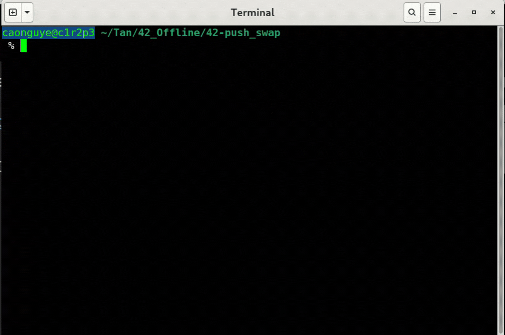
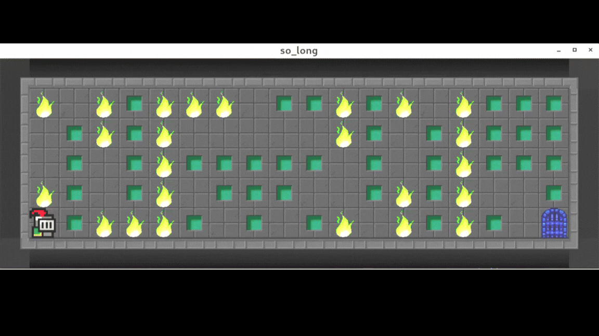
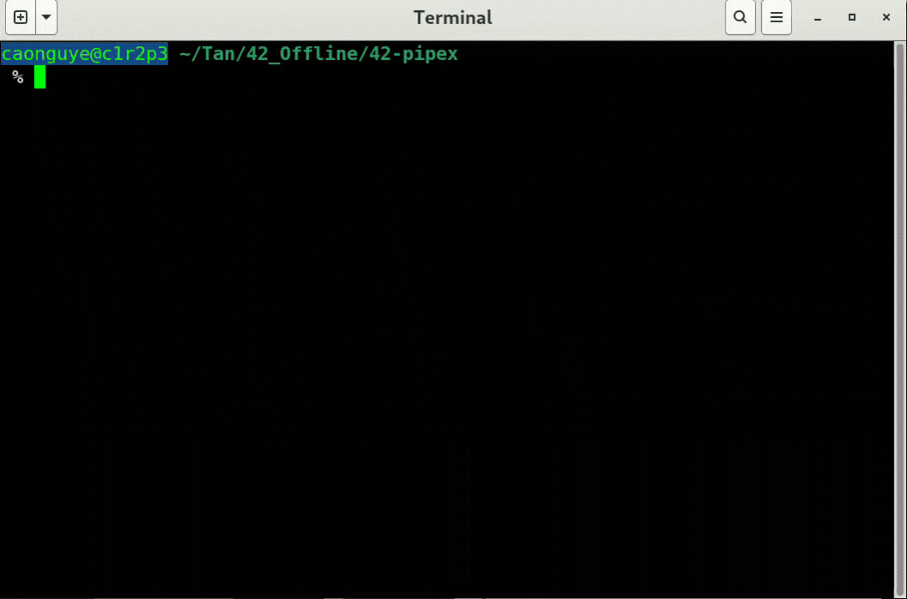
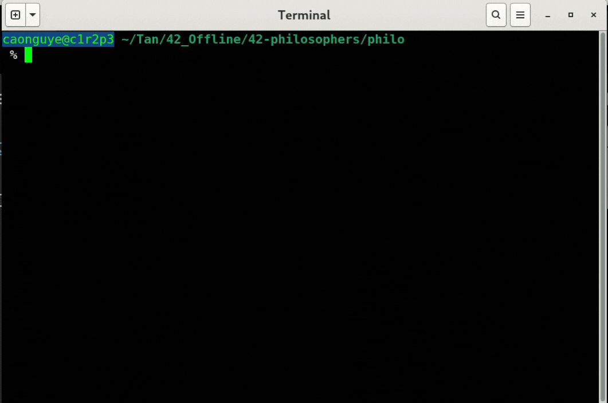

# Project-Overview

## [Push Swap](https://github.com/Siuol7/42-push_swap.git)📈 

| ***Execute & Makefile tutorial*** | ***Visualizing my program sorting 500 random numbers*** |
|-----------|--------------|
|  |  |

## [So Long](https://github.com/Siuol7/42-so_long.git)🎮
| ***Execute & Makefile tutorial*** | ***Game displaying on screen*** |
|-----------|--------------|
|  |  |

## [Pipex](https://github.com/Siuol7/42-pipex.git)🔧               ## [Philosophers Dinner](https://github.com/Siuol7/42-philosophers.git) 🍴
| ***Execute & Makefile tutorial***|| ***Execute & Makefile tutorial with 200 philosophers***|
|-----------|-----------|
|  |  |

