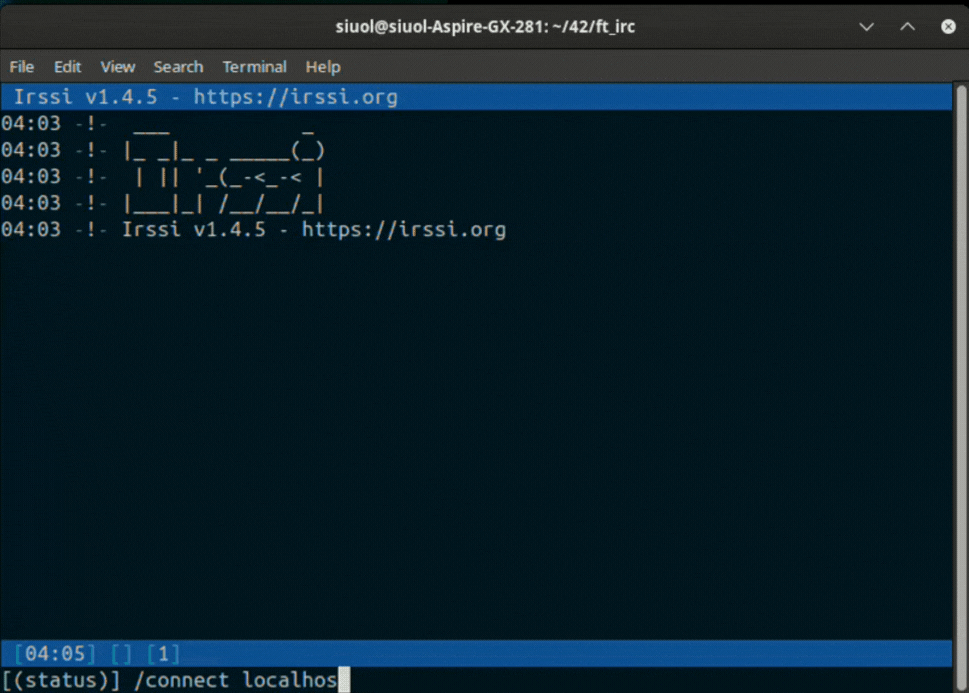
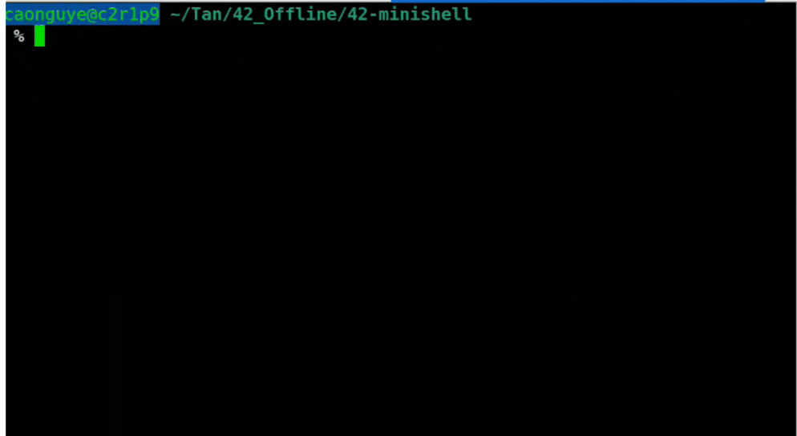
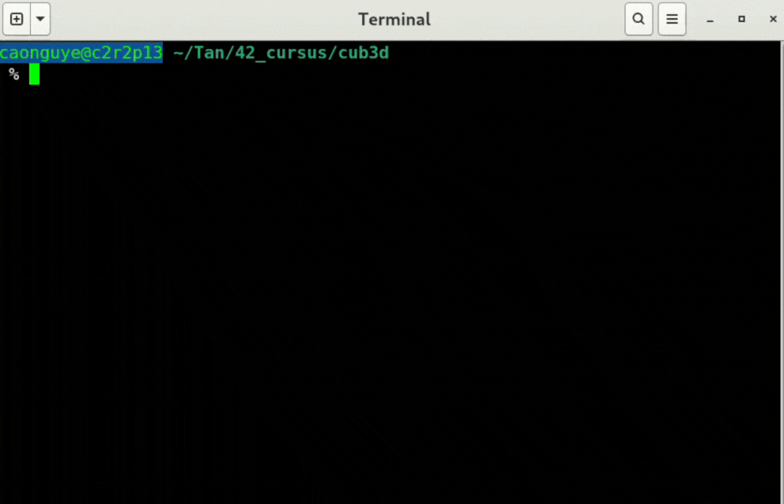

# Project-Overview

## [42 ft_irc]()🌐
| ***IRC Server Terminal*** | ***Client 1 Connection*** | ***Client 2 Multi-chat*** |
|-----------|--------------|-----------|
|  |  |  |

## [Minishell](https://github.com/Siuol7/42-minishell)🐚

| ***Execute & Makefile tutorial*** |
|-----------|
|  |

## [Cub3D Game](https://github.com/Siuol7/42-Cub3d) 🎮

| ***Execute & Makefile tutorial*** | ***Playing Cub3d moving and stabbing*** |
|-----------|--------------|
|  |  |

## [Push Swap](https://github.com/Siuol7/42-push_swap.git)📈 

| ***Execute & Makefile tutorial*** | ***Visualizing my program sorting 500 random numbers*** |
|-----------|--------------|
|  |  |

## [So Long](https://github.com/Siuol7/42-so_long.git)🎮
| ***Execute & Makefile tutorial*** | ***Game displaying on screen*** |
|-----------|--------------|
|  |  |

## [Pipex](https://github.com/Siuol7/42-pipex.git) 🔧 &nbsp;&nbsp;&nbsp;&nbsp;&nbsp;&nbsp;&nbsp;&nbsp;&nbsp;&nbsp;&nbsp;&nbsp;&nbsp;&nbsp;&nbsp;&nbsp;&nbsp;&nbsp;&nbsp;&nbsp;&nbsp;&nbsp;&nbsp;&nbsp;&nbsp;&nbsp;&nbsp;&nbsp;&nbsp;&nbsp;&nbsp;&nbsp;&nbsp;&nbsp;&nbsp;&nbsp;&nbsp;&nbsp;&nbsp;&nbsp;&nbsp;&nbsp;&nbsp;&nbsp;&nbsp;&nbsp;&nbsp;&nbsp;&nbsp;&nbsp;&nbsp;&nbsp;&nbsp;&nbsp;&nbsp;&nbsp;&nbsp; [Philosophers Dinner](https://github.com/Siuol7/42-philosophers.git) 🍴

| ***Execute & Makefile tutorial*** | ***Execute & Makefile tutorial with 200 philosophers*** |
|-----------|-----------|
|  |  |

